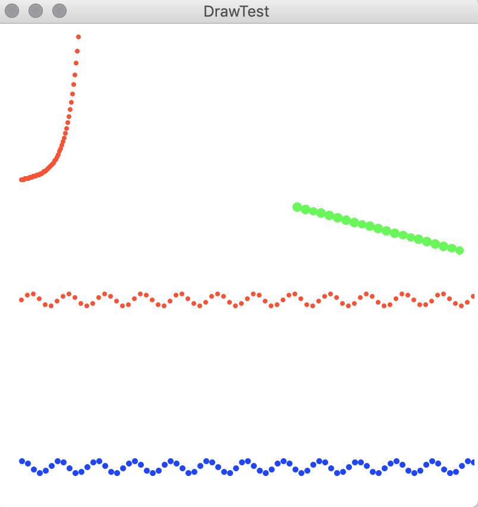
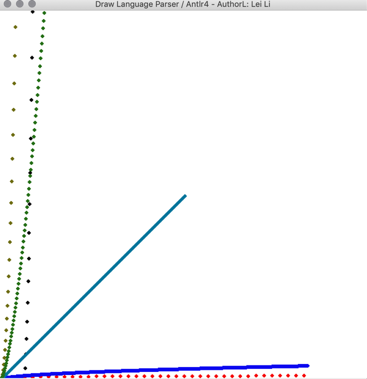

# 简单绘图语言的解释器
Project of Compile Principle in XDU, an interpreter for a simple draw language

西电编译原理课程大作业，简单绘图语言的解释器。

支持语句：

```php
size is 10 * 0.5; // 设置 dot 大小
color is 1; // 设置颜色
origin is (20, 30); // 设置原点
scale is (5, 5); // 设置 x 轴 y 轴 缩放比例
for t from 0 to 80 step 1 draw(t, sin(t)); // for 绘制语句，画出正弦函数
```

## Python Version

Files under `python` directory.

通过分析语法，构造有限状态自动机，利用递归下降子程序法，实现解释器功能。

运行程序：`python3 draw.py ./test_file/fn.txt`

运行结果（源代码见 `./test_file/fn.txt`）：



文件组成：

`lexer.py`：词法分析器

`parser.py`：语法分析器，在产生语法树的同时执行相应的语义动作。

## Antlr4 Version

利用 [ANLTR4](https://github.com/antlr/antlr4) 生成相应的词法分析与语法分析器，构建相应的前后端程序驱动词法分析，利用 Java 编写相关语义执行动作的代码，完成绘图。

Codes are under `antlr` directory.

文件组成：

*1.* *DrawLangLexerRules.g4**：**Antlr4**词法规则*

*2.* *Draw.g4**：**Antlr4* *语法规则*

*3.* *UIBase.java: UI* *接口定义，定义了相关的**UI**操作*

*4.* *DrawUI.java**：**UI* *接口的实现*

*5.* *DrawVisitorGUI.java**：**Visitor**模式的代码，通过遍历语法树来执行相应的语义动作*

*6.* *DrawLangErrorReporter.java:* *差错汇报器*

*7.* *DrawFrontEnd**：解释器前端驱动程序*

*8.* *DrawBackEnd**：解释器后端驱动程序*

*9.* *DrawLangMain**：绘图解释器的**Main**程序，程序的入口*


Image Output of `draw.test2`：




